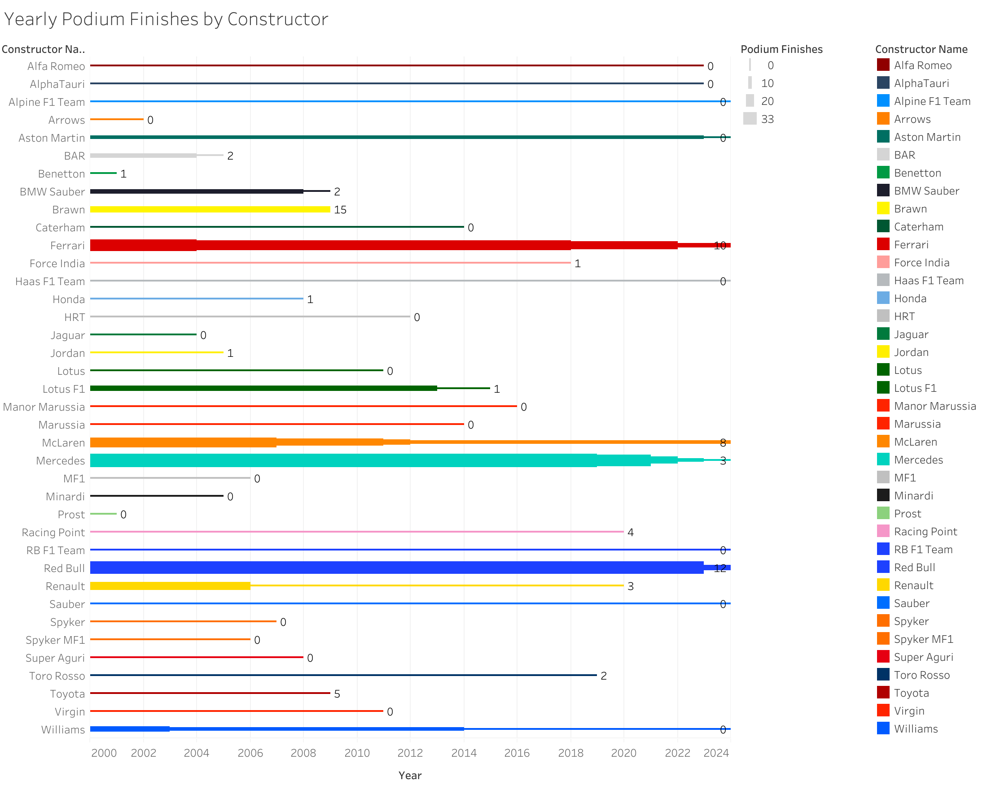
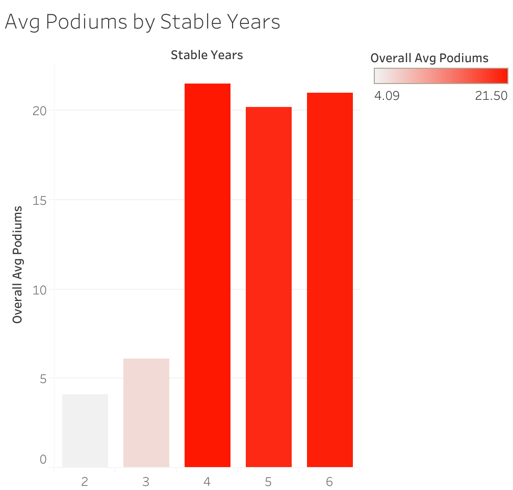

# 🏎️ F1 Performance Analysis: Driver Pairing & Podium Trends (2000–2024)

A SQL-driven analysis exploring how driver pairing stability impacts Formula 1 constructor performance, using data from 2000 to 2024. Built with BigQuery SQL and designed for future extensibility beyond podium counts.

---

## 📊 Summary of Queries

### 🔍 Query 1 – `01_f1_base_query.sql`
**Purpose**: Builds a unified dataset of constructor-driver pairings by season and counts how many podiums each team achieved that year.

**What it does**:
- Joins race, result, driver, and constructor tables
- Filters to podium finishes only (positions 1–3)
- Aggregates each constructor’s annual driver lineup
- Counts total podiums per team per year

---

### 🔁 Query 2 – `02_f1_pairing_stability.sql`
**Purpose**: Identifies constructors who retained the same driver pair across multiple seasons.

**What it does**:
- Groups constructor + driver pair arrays across seasons
- Filters to only those pairings that stayed together for 2+ years
- Tracks all seasons in which the stable pair raced

---

### 📈 Query 3 – `03_f1_stability_vs_podiums.sql`
**Purpose**: Measures how podium performance varies by driver pairing stability.

**What it does**:
- Joins stable pairings to the base query’s podium data
- Calculates average podiums during stable seasons
- Aggregates and groups by number of years a pair stayed together

---

## 📈 Visualizations

### Query 1: Podium Finishes by Constructor-Year Pairing

Shows the total podiums earned by each constructor per year between 2000–2024, highlighting dominant teams and standout seasons.

### Query 2: Podium Performance of Stable Driver Pairings (2+ Years)

Analyzes how driver pairings that have stayed together for two or more consecutive years perform in terms of total podium finishes, showing a positive correlation between partnership stability and success on the podium.

> *Longer-lasting driver partnerships, such as Schumacher-Barrichello’s six-year collaboration at Ferrari, tend to accumulate more podiums, underscoring the importance of team continuity in Formula 1 performance.*

### Query 3: Average Podiums per Year by Driver Pairing Stability

Examines how the length of time two drivers race together (pairing stability) influences their average podium finishes per year from 2000–2024. 
> *The chart reveals that longer-lasting partnerships generally correlate with higher average podiums, highlighting the strategic value of consistency in team lineups.*

---

## 🛠️ Tools Used
- **BigQuery SQL**
- **Google Cloud Console**
- **Tableau**

---

## 🔑 Key Insight
> Teams with more stable driver pairings (especially those maintained over 3+ seasons) show higher average podium performance, suggesting continuity plays a role in success.

---

## 🔗 Data Source

- [Kaggle: Formula 1 World Championship Dataset (1950–2020)](https://www.kaggle.com/datasets/rohanrao/formula-1-world-championship-1950-2020)
